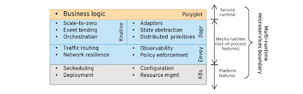
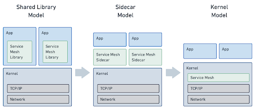
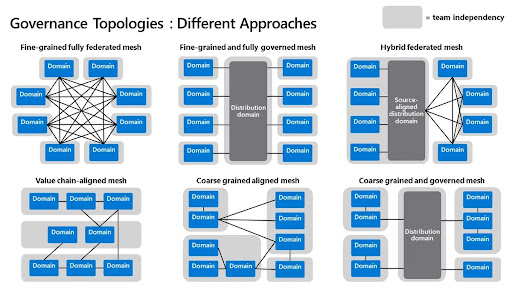
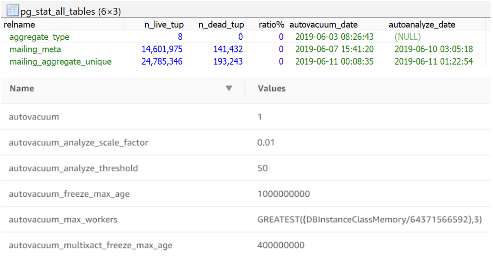
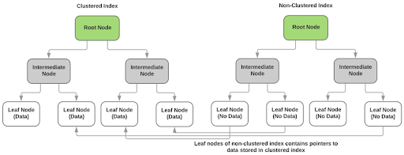

# Object Oriented Programming

### SOLID Principle

- _Single Responsibility_ principle - e.g. customer class shouldn't use logging functionality
- _Open/closed principle_ - e.g. conditions of a type shouldn't be updated in another class
- _Liskov substitution principle_ - e.g. implement interface instead of inheritance if necessary
- _Interface segregation principle_ - e.g. Implement multiple interfaces, instead of empty functions
- _Dependency inversion principle_ - e.g. constructor passes in interface of ILogger

### Concepts

- Encapsulation - Private Methods
- Inheritance - `Class : BaseClass, Interface`
- Polymorphism
  - Method Overriding (run-time) or Method Overloading (compile-time);
  - Assign instance of Derived to a variable of type Base
- Abstraction - Abstract Classes
- Aggregation - child class can exist independently of the parent class
- Composition - child class cannot exist independently of the parent class
- Composibility - reusable components/functions/libraries
- Coupling - A class that relies on another class so changes affect both
- Cohesion
  - High cohesion a class is focused on what it should be doing
  - Low cohesion a class does a great variety of actions, broad

### Design Patterns

- _Singleton_ - One single instance of an object (Singleton.Instance)
- _Command_ - Undo / Redo the collection of commands in an object
- _Composite_ - Tree structure using Leaf, Parent, Root nodes
- _Proxy_ - One class uses all functionality of the real class.
- _Abstract Factory_ - Client class providing all interaction & functionality of abstract class without knowledge of deriving classes (concrete classes)
- _Method Factory_ - same as Abstract Factory but Main() Subclass instantiates and uses functionality

* Inversion of Control (IoC)
  * Dependency Injection
    * Registration of service instances based on contracts (interfaces) at bootstrap
    * Identify the services listed in the constructor’s signature by a name mapping
    * Lookup service in Service Factory Repository (IoC Container), instantiate if null
    * Provide instance of service through constructor
    * e.g. AutoFac, StructureMap, Ninject, Unity Application Block, Spring.NET, CastleWindsor
  * Events and Delegates
  * Observer Pattern (Push-based notification IObserver<T> & IObservable<T> provider)
  * Service Locator (HttpContext.ApplicationServices.GetService(typeof(ISomeService)))

- Map/Reduce (NoSQL Data retrieval)
  - Map uses Views to build Queries, allowing for distributed query processing 
  - Reduce takes result of Map query, and aggregates data as results

* Saga Pattern
  * Uses compensation instead of ACID rollback
  * e.g. Book flight -> Hotel reservation -> cancel reservation -> cancel flight

- Sidecar pattern / sidekick pattern
  - attached to a parent application and provides supporting features for the application
  - separate process or container to provide isolation and encapsulation

* UI Patterns - MVC & MVVM (Silverlight) & MVP (Model View Presenter)

- Domain-Driven Design (Bounded Contexts - Single Responsibility Principle) [Eric Evans]
  - Entities (The “nouns” with Identity and Lifecycle)
    - Infrastructure Ignorance - Persistence and UI Ignorance
    - A uniquely identifiable object (`IEquatable<T>`) (Readonly identity property)
    - Control of access to children objects within the aggregate
    - e.g. `Customer.AddOrder(theOrder)` NOT `Customer.Orders.Add(theOrder)`
    - e.g. `Order.CanBeAddedToCustomer` NOT `Order.Item.Count() == 0`
    - Behaviors e.g. `Order.Cancel()` NOT `Order.Status == Status.Cancel`
  - Value Objects (Descriptors or properties of primitive properties)
    - Intrinsic value represents its uniqueness (property by property comparison)
    - fields are immutable
    - e.g. `public class Customer { public Name FullName { get; set; } }`
    - where `public class Name { public string FirstName { get; set; } public string LastName { get; set; } }`
  - Aggregate Roots (Combining Entities and holding references) - “Parent”
  - Domain Services (Operations or Processes, stateless and cohesive)
    - Behaviours that don't belong to existing Entities
  - Repositories (In-Memory Collections)
    - `CustomerRepository.GetById(int Id)` is a data-retrieval action (`PersistenceRepository<Customer>`)
    - `GetCustomer(Customer customer)` is a domain-centric action (`ICustomerRepository`)
    - Shouldn't return `IQueryable<Customer> GetCustomers()`
    - Divide repository/API of same Type rather than all api calls in one
    - `ICustomerRepository { RemoveCustomer(Customer customer), AddCustomer(Customer customer) }`
      - found in the Domain project as the "shape", but the implementation exists in Infrastructure project)
    - e.g. `public class Customers : PersistenceRepository<Customer>, ICustomerRepository`
  - Validation
    - Persistence Rule (NOT NULL column) vs Business Rule (ship order for valid customers under credit limit)
    - Validation for Value Objects should exist in its constructor. No need to validate anywhere else because of immutability.
    - Validation for multiple entities could be looked at behaviorally (e.g. `order.CanShipTo(customer)` or `customer.CanShip(order)`)
    - Validation can be separated into Validator service (e.g. `shippingValidator.CanShip(customer, order)`)
  - Anti-patterns
    - Don't suffix layers e.g. `CustomerRepository` or `CustomerEntity` or `CustomerService`
    - Don't use repository like DAL e.g. `repository.Save()`, `repository.Get()`, `repository.Load()`
    - Don't separate Data and Behaviour

# Programming Paradigms

- Imperative Programming (OOP)
- Strongly-typed - "1" + 2 will result in a type error
- Weakly-typed = "1" + 2 = "12" - "type-coercion" (implicit conversion of data types)
- Static type checking (compile time)
- Dynamic type checking (runtime)

# Architecture

- CQRS (Command Query Responsibility Segregation)
  - One model to read information, another one to update information.
- Clean Architecture
  - Framework & Drivers (Web | Devices | DB | UI)
    - Interface Adapters (Controllers | Presenters | Gateways)
      - Application Business Rules (Use Cases)
        - Enterprise Business Rules (Entities)

# Distributed Systems

- CAP Theorem (NoSql trade-offs)
  - Consistency (all nodes return the same data) most recent write guaranteed
    - MongoDB, Redis, HBase
  - Availability (request receives response, success or fail) most recent write not guaranteed
    - Cassandra, DynamoDB
  - Partition Tolerance (system operates despite arbitrary partitioning due to network failures)

* Four Primitives / Categories
  * Lifecycle - Packaging, Healthcheck, Deployment, Rollback, Scaling, Configuration
    * Kubernetes, Knative
  * Networking - Service discovery, Load balancing, Retry, Timeout, Circuit-breakers, Rate limiting, Observability
    * Service mesh (Istio), Consul, Envoy, Dapr, Azure Service Fabric
    * Rate limiting
      * Concurrency limit - resources limited at any given time 
      * Token bucket limit - availability of resources after a given interval
      * Fixed window limit - number of resources for a given time before time reset
      * Sliding window limit - number of resources for a given time from now
  * Binding - Message transformation, Message routing, Protocol conversion, Pub/Sub
    * Camel-K
  * State - Workflow management, Caching, Idempotency, Application state, Scheduling, Transactionality (SAGA)
    * AWS Step Functions, Redis



- Eight Fallacies
  1. The network is reliable
  2. Latency is zero
  3. Bandwidth is infinite
  4. The network is secure
  5. Topology doesn't change
  6. There is one administrator
  7. Transport cost is zero
  8. The network is homogeneous

* Service Mesh (Networking)
  * moving networking-related concerns from the service containing the business logic, outside and into a separate runtime
  * advanced release strategies, advanced routing, managing security, metrics, tracing, recovery from errors, simulating errors without touching the service, application-specific protocols

- Service Mesh evolution



* Data Mesh



- Fine-grained fully federated
  - Purest form - agile, cloud based
  - highly skilled engineers
- Fine-grained fully governed
  - quality and compliance over agility
  - financial institutions and governments
- Hybrid federated
  - Organisations with legacy systems
  - Lack highly skilled engineers
- Value chain-aligned
  - Organizations in supply-chain management, product development, or transportation industries
- Coarse grained aligned
  - Large-scale organizations 
  - Complex architectures with many applications require multiple governance levels
- Coarse grained and governed
  - Large-scale organizations
  - Overcome complexity, peer-to-peer distribution

# Microservices

- Service Discovery
  - Client-side discovery using a Service Registry
  - Server-side discovery using a Load Balancer
  - Storing service information
    - CP - Consistency & Partition Tolerance (Zookeeper, etcd, Consul)
    - AP - Availability & Partition Tolerance (Cassandra, Riak)
- API Management
  - Versioning (Anti-Corruption Layer)
  - API Gateway Services (one task routed to one service maintaining different service requests)
- Communication
  - Point-to-point (standard client-server communication)
  - Publish-subscribe (Spark Streaming, Kafka, Amazon Kinesis, Azure Stream Analytics, Solace)
- Integration with the outside world
  - Synchronous callbacks - strong coupling
  - Avoiding cascading failures
    - Back-pressure - velocity of flow of data (Reactive Streams - RxJava, Akka, Spark)
    - Circuit-Breaker Pattern over Retries (Netflix Hystrix)
    - Retry with exponential backoff
- Security
  - Authentication
    - TLS Client Certificates
    - HTTPS Basic Authentication
    - Asymmetric Request Signing 
  - Authorisation
- Data Coordination
  - Apology-Oriented Programming
  - Event-Driven Architecture
  - Causal consistency (Riak, Red Bull’s Eventuate)
  - Saga Pattern - Distributed transactions

# Eventual Consistency

- CRDT (Conflict-Free Replicated Data Type) (Information)
  - ACID 2.0
    - Associative - `(A*(B*C)) = (A*B)*C`
    - Commutative - `(A*B = B*A)`
    - Idempotent - `(A*A=A)`
    - Distributed
  - Types
    - CmRDT (Commutative RDT) - operation based (sends A++)
    - CvRDT (Convergent RDT) - state based (sends {A=1})
    - Delta CRDT (Delta mutator) - delta based (sends state delta)
      - Small message + idempotency (bulked, causal consistency)
      - Monotonic (absence of rollback)
- Gossip Protocol (Communication)
  - Push - per cycle => if we know X, tell peers
  - Pull - per cycle => ask peer about X
  - Types
    - Rumour (Viral) - propagates, push based
    - Anti-entropy (Removing Inconsistencies)
    - Aggregate (Averaging) - pull based
- Consistency Types
  - Causal consistency (ordering of updates for all nodes)
  - Read-your-writes consistency (process A gets its updated value)
  - Session consistency (read-your-writes consistency if a session exists)
  - Monotonic read consistency (subsequent reads of a value won’t return older values)
  - Monotonic write consistency (writes by same process must complete before another write)
- Raft Consensus Algorithm
  - Two phase commit
    - Contact every participant, suggest a value and gather their responses
    - If everyone agrees, contact every participant again to let them know. Otherwise, contact every participant to abort the consensus.
  - etcd, consul, YugabyteDB, CockroachDB, TiDB, MongoDB (partially), InfluxDB (partially)
  - Weave Mesh (uses Gossip protocol)

# Event Streams

- Data Streaming - Log commits
- Publish-subscribe
- Graph-structured data model (Quine)
- Messaging Protocol
  - At most once (Sender -> Receiver)
  - At least once (Sender (ack) -> Receiver)
  - Exactly once (Sender (ack) -> Receiver (ack))
- Tools 
  - Apache Kafka (pub/sub event logs)
  - Apache Flink (stream & batch processing)
  - Apache Storm (stream processing)
  - Apache Spark (micro batch processing)
  - Amazon Kinesis (pub/sub event logs)
  - Azure Event Hub (pub/sub event logs)

# Kubernetes

- Master node (Container Services) - Control plane
  - API Server (Entry point for UI, CLI)
  - Controller Manager (monitors health of cluster)
  - Scheduler (ensures Pod placement based on available resources)
  - etcd (key value storage of cluster state and configuration)
    - ConfigMap - external configuration to the applications
    - Secret - configuration stored in base64 hash
  - State for data plane service proxies
    - configuration, telemetry, security (Istio)
- Worker nodes (Container Host)
  - Kublete (node agent)
- Deployments (Pod Wrapper)
  - Specify replicas
- StatefulSet (Pod Wrapper)
  - Specify shared volume for database type Pods
- Pods (Container Wrapper)
  - Multiple containers can exist in pod and communicate via localhost
    - Init containers (run on pod start-up sequentially)
    - Application containers (sidecar, main, run in parallel)
      - controller <-> resource definition (for actual vs desired instances)
      - custom controller e.g. detect config changes to restart pod and use new config
  - Service attached to pod (all replicas)
    - Allocated IP address with load balancer
    - Internal service (for pod with db)
      - Volume (local or external)
    - External service (for pod with web app) <- ingress
  - Readiness checks on start-up to decide when to accept traffic
  - Liveness check to continually check health
  - Workloads
    - Replica sets (Stateless microservice)
    - Stateful set (Singleton)
    - Cron jobs
  - Data plane (Service mesh) - Envoy
    - Service mesh interface specification
    - HTTP Caching, traffic routing
    - Protocols for MongoDB, ZooKeeper, MySQL, Redis, Kafka
    - WebAssembly support
- Operators - Kubebuilder / Operator SDK
  - More complex lifecycle implementations
    - e.g. S3 backup of state before redeploy, trigger recoveries, queues, monitoring
- Knative (serverless capabilities - scale-to-zero)
  - Knative Serving (request-response)
  - Knative Eventing (event-driven)
    - Starting a broker with an importer (Apache Camel) to import external events
    - Importers allow subscribing from containers using YAML declarations
- Dapr (sidecar toolkit for service discovery, tracing, retries, pub/sub, cloud APIs, key-value stores)
  - Explicit sidecar that can be called via HTTP or gRPC (instead of transparent sidecar like service mesh proxy)
- Cloudstate (sidecar for state management)
  - use gRPC withing container function to call sidecar to retrieve and interact with state
  - underlying state is abstracted
  - event sourcing, CQRS, key-value lookups, messaging

# Solace PubSub+

- publishers
  - publish to a topic (event brokers use topics to route messages to their destination)
  - topics are subjects that are part of the message header (i.e. animals/domestic/cats)
- message broker
  - message VPN (unique names per VPN)
    - topic endpoints - topic subscriptions configured
      - selectors/filters - messages are only persisted if they match both the topic subscription and the selector
        - topic endpoints require the removal of messages to be read
    - queues - topic subscriptions configured
      - selectors/filters - queues persist every message even if they don’t match the selector
      - exclusive (a message can only be consumed by one consumer - fault tolerance can be implemented with a standby application)
      - non-exclusive (messages are load balanced - round robin distribution to connected applications)
      - queue can be read from without removing messages
    - clients - topic subscriptions configured
- consumers
  - direct messaging - reliable, but not guaranteed
    - delivered to subscribing clients in the order in which publishers publish them
    - don't require acknowledgment of receipt by subscribing clients
    - aren't retained for a client when it's not connected to an event broker
  - guaranteed messaging - ensure the delivery of a message between two applications
    - event broker must have message spooling enabled
    - if an ingress message cannot be received (e.g. spool quota is exceeded) the publisher is not acknowledged, and the appropriate event broker statistic is incremented
  - eliding enabled
    - consumers only receives the most recent message held in the event broker

# Data Store Types

| RDBMS | NoSQL | Data Warehouse |
| - | - | - |
| Vertically Scalable | Horizontally Scalable |  |
| ACID Rule | CAP theorem | |
| Row-Oriented storage | Unstructured Data | Column-Oriented storage |
| Online Transactional Processing (OLTP) | | Online Analytical Processing (OLAP) |
| Transactional updates | | Bulk inserts |
| Structured Relational Data - normalised to reduce redundant data. Optimized to maximize efficiency of updating data (insert, update, delete) | Simple fast lookups for Hierarchical collection of records; map-reduce over many nodes etc | Store large quantities of historical data; enable fast, complex queries across data |

# Postgres

- Features
  - Performance
    - `EXPLAIN ANALYSE`
  - Clustered Indexes
    - `CLUSTER table USING idx_table;`
  - Partition Tables
    - `CREATE TABLE "table" (...) PARTITION BY RANGE (timestamp);`
  - Materialized Views
    - `CREATE MATERIALIZED VIEW mymatview AS SELECT * FROM mytab;`
    - `REFRESH MATERIALIZED VIEW mymatview;`
  - Vacuuming
    - `VACUUM ANALYSE table;`



# SQL Server

- ACID Rule (Transactions)
  - Atomic - independent of previous and subsequent transactions
  - Consistent - no unfinished updates on commit/rollback (referential integrity)
  - Isolated - no intermediate statements visible to other transactions
  - Durable - on commit, data is persisted regardless of crashing (backups)
- DDL - Data Definition Language (CREATE TABLE, CREATE PROC)
- DML - Data Manipulation Language (INSERT, UPDATE, DROP, SELECT)
- Principals (Logins/Users) & Securables (Tables/Views/Stored Procedures) & Permissions (Roles)
  - Login - Server level principal used with password
  - User - Database level principal used with login
  - Schemas - Database namespace for grouping objects together (user ownerships)
  - Roles - used to grant groups of permissions to tables/views rather than direct granting from users to tables/views
- Isolation Levels (Transactions)
  - Read Committed - Transaction only reads committed data (default)
  - Read Uncommitted - Transaction can read uncommitted data ("dirty read")
  - Repeatable Read - only reads committed data & inconsistencies from multiple lookups of the same data is not allowed
  - Snapshot - only reads state of data from beginning of transaction (BEGIN TRANS)
  - Serializable - locks all SQL statements within transaction for update & inserts
- Lock hints (SQL SELECT Statements)

| Lock hint | Behaviour |
| - | - |
| NOLOCK |  |
| ROWLOCK | _shared lock - compatible with shared and update locks_ |
| PAGELOCK (default) | _shared lock - compatible with shared and update locks_ |
| TABLOCK | _shared lock - compatible with shared and update locks_ |
| UPDLOCK | _update lock - only compatible with shared locks (promoted to exclusive when shared locks are released)_ |
| HOLDLOCK | _exclusive lock - not compatible with any types of locks_ |
| READPAST | _ignore locks_ |

- Clustered index key vs. non-clustered index key
  - Clustered - physically reorders stored records (unique index) (b-tree)
  - Non-clustered - logical order of the indexes (holds index rows not data rows)



- Performance tuning
  - SQL Profiler to find stored procedures with long durations
  - Maintenance Plans to refresh statistics for Query Optimizer to make correct Estimated Plan
  - Execution Plans to change table scans to index seeks
- Page - 8kb [Page Number | Page Type | Free Space | Allocation Unit ID]
  - Page Types (Data, Index, Text/Image, Allocation Maps, Free Space)
- Schemas
  - `ALTER AUTHORIZATION ON SCHEMA::HR_Acc to Adel`
- Indexed Views
  - `CREATE VIEW V1 WITH SCHEMABINDING AS`
- Column Store Index
  - `CREATE CLUSTERED COLUMNSTORE INDEX index_name ON table`
- Connection String
  - `"Data Source=mySqlServer;InitialCatalog=myDatabase"`

# NoSQL
Scale-out horizontal distributed systems vs Scale-up vertical upgrading in RDBMS

- Document (MongoDB, CouchDB, RavenDB, MarkLogic)
- Key-value (DynamoDB, Table Storage, Redis, Riak, MemcacheDB, PalDB, Project Voldemort)
- Column (HBase, Accumulo, Cassandra)
- Graph (Neo4J, OrientDB, Allegro, Virtuoso)
- Real-time (RethinkDB, Firebase)

# NewSQL

- RDBMS providing scalability of NoSQL for transaction processing workloads & maintains ACID
- AWS Aurora, Yugabyte, CockroachDB, Google Spanner, MemSQL, Clustrix, VoltDB, NuoDB
- SQL Engines (MySQL Cluster, Infobright, TokuDB)
- Transparent Sharing (ScaleBase)
- In Memory Databases (Hekaton SQL Server 20214, Apache Geode)
  - MicroStream (persistence engine for storing Java objects and documents)

# Big Data

- Definition
  - Volume (Petabytes of data stored)
  - Velocity (Terabytes of data collected i.e. IoT)
  - Variety (Semi-structured data)
  - Complexity (From many sources)
- ETL (Extract, transform, load)
  - Matillion (load into Redshift/Snowflake)
  - AWS Glue
  - AWS Data Pipeline (obsolete)
  - SSIS (SQL Server Integration Services)
- AWS
  - QuickSight - cloud-scale business intelligence (BI) service
  - Glacier - used for backup storage. Elastic MapReduce Service
  - Redshift - Petabyte for data storage.
- Azure Data Lake - analytics in the cloud (uses U-SQL)
- In-Memory computing (MSSQL ColumnStore (CS), StarCounter, memSQL, InnoDB)
- BI Tools
  - SSAS (MSSQL Analytics Service)
    - Dimensions (Groups)
    - Measures (values to sum, count average, max, min etc)
    - Filters
    - Facts (all possible raw values)
  - Looker
  - Apache Druid
    - Open-source analytics data store designed for BI (OLAP) queries on event data
    - Provides low latency real-time data ingestion, flexible data exploration & fast data aggregation
  - Apache Pinot
    - index Kafka streams and support low-latency queries
- Apache Hadoop & Storm (uses Hive query language on databases like HBase and Cassandra)
  - Presto - SQL Query Engine on Hadoop
    - Query parser > planner > scheduler > worker (grabs from underlying data store)
- Apache Spark
  - Driver (one) -> Executors (many)
  - RDD (Resilient Distributed Dataset) - needs to be serializable
    - Transformations (lazy - separate executor tasks) - map(), union(), join(), filter(), distinct()
    - Actions (returns execution to driver) - reduce(), collect(), count(), take(), foreach()
    - persist() or cache() stores RDDs from transformations into memory
    - repartition() expensive reshuffling to evenly distribute RDDs across executors
    - broadcast variables and accumulators
      - variables aren’t passed across machine e.g.
        ```java
        // bad
        val counter = 0
        rdd.foreach(x => counter += x)
        ```
        ```java
        // good
        val counter = sc.longAccumulator("My Accumulator")
        rdd.foreach(x => counter.add(x))
        ```
  - Structured Streaming (Lambda Architecture / Micro-Batch processing)
    - Unbounded input table running incremental queries
- Kafka Streams
  - Java API running in app (no separate processing cluster)
  - Supports per-record stream processing
  - Windowing operations, stateless transformations (filter, map), stateful (joins, aggregations)
- Change Data Capture (CDC)
  - Database log scanner - Debezium - consumes data from transaction log
- Data Storage Techniques
  - Bitmapping
  - HyperLogLog (HLL) - (with Postgres)
    - constants - log2m , regWidth
    - library for jvm `"net.agkn" % "hll" % "1.6.0"`
    - import: `import net.agkn.hll.HLL;`
    - add new
      ```java
      HLL hll = new HLL(config.log2m, config.regWidth)
      hll.addRaw(
        Hashing.murmur3_128().newHasher().putBytes(newValue).hash().asLong()
      )
      byte[] value = hll.toBytes
      ```
    - append to existing
      ```java
      HLL hll = HLL.fromBytes(value.getBytes(1))
      hll.addRaw(
        Hashing.murmur3_128().newHasher().putBytes(newValue).hash().asLong()
      )
      byte[] value = hll.toBytes
      ```
    - reading distinct value:
      ```java
      HLL hll = HLL.fromBytes(value);
      var distinct = hll.cardinality();
      ```

# Machine Learning

- Causal <-> Correlation
- Supervised learning e.g. Fraud detection, recommendation engine, spam filtering
  - Labeling datasets (Regression and Naive Bayes Classification, Alternating Least Squares)
- Unsupervised learning e.g. Social networks, language prediction
  - Unlabelled datasets (AFK-MC², k-means and Principle Component Analysis algorithm)
- Semi-supervised Learning e.g. Image categorization, Voice recognition
  - Labeled and Unlabelled datasets (Regression and Classification - Support vector machines, Decision Trees [Gradient-Boosted Trees and Random Forests])
- Reinforcement learning e.g. Artificial Intelligence
  - Maximize a numerical reward goal

### Steps

1. Import data
1. Clean data (duplicates, irrelevant, incomplete)
1. Split data (training / testing)
1. Create model (create algorithm to analyze data)
1. Train model
1. Make prediction
1. Evaluate and improve

### Services

- Microsoft Azure Machine Learning - Cortana Analytics Suite
- Google Prediction API - TensorFlow
- Apache Spark (MLlib)

# Data Serialization

### Binary Formats

- Protobuf - Google
  - Compiler to strong types
    ```bash
    protoc -I=$src --csharp_out=$dst $src/foo.proto
    ```
- Parquet
- Thrift
- Avro - compact binary data serialization format similar to Thrift or Protocol Buffers
  - with additional features needed for distributed processing environments such as Hadoop
- Captain Proto

# CI/CD

- Continuous Integration - commit -> build -> test
- Continuous Delivery - commit -> build -> test -> push to staging -> approve before push to prod
- Continuous Deployment - commit -> build -> test -> push to staging -> push to prod
- Strategies in CI
  - Traditional - Deploy new version on top of old version in one go
  - A/B Testing - Deploy to specific nodes one at a time using feature flags
  - Rolling Deployment - Deploy incrementally one by one (or rolling window)
  - Canary Deployment - Deploy to % of nodes, monitor, then deploy to the rest
  - Blue-Green Deployment - Deploy to a replica staging environment, switch from stage to live
- Tools
  - buildkite (yaml configuration)
  - Teamcity
  - Jenkins
  - GitHub Actions
    - GitHub Events - Issue created, PR created, PR merged, Contributor joined
    - Trigger an Action - label, sort, assign to contributor, unit test
    - Workflow - chain of Actions
    - Organisational Tasks
  - Octopus Deploy (.NET)
  - Spinnaker (Netflix)
  - Go (Thoughtworks)

# Infrastructure as Code

  - Terraform (Hashicorp)
  - CloudFormation (AWS)
  - Bicep (Azure)

# Security

- Objective > Overview > Decompose > Identity Threats > Identify Vulnerabilities
- Priority of vulnerabilities - likely vs unlikely - high risk vs low risk
- Encryption in transit / Encryption at rest / Authorization
- Http Authorization (401 Unauthorized / 403 Forbidden)
- Http Authentication
  - Basic (Username:Password base64)
  - Digest (uses MD4)
  - Tokens (OAuth / OAuth2 / OpenId Connect)
    - Request token (Client > Server)
    - Response token & token secret (Server > Client)
    - Login (Client > Server)
    - Redirect (Server > Client)
    - Request access token (Client > Server)
    - Response access token (Server > Client)
  - U2F (Universal 2-Factor Authentication) - physical device key
    - Login (Client > Server)
    - Verify login, response challenge (Server > Client > Device)
    - Display challenge (Device > Client > Server)
- RSA public-key cryptography (asymmetric encryption i.e. public/private keys)
  - Alice uses **Bob’s public key** to encrypt Alice’s plain text message
  - Bob uses **Bob’s private key** to decrypt Alice’s cypher text message
  - SSH key generation
    - `ssh-keygen -t ed25519 -C "adel.helal@email.address.com"`
    - SSH Key created in `/Users/ahelal/.ssh/id_ed25519.pub`
    - Copy contents into SSH key settings for e.g. GitHub
- Unified ID 2.0 - the trade desk - demand-side platform (DSP)
  - Replacement to third-party cookies from Chrome

### Encryption

- SHA1 -160-bit hash value. Rendered as a hex number, 40 digits long. Exploited by "collision".
- MD5 - 128-bit hash value. One way hashing which gets truncated. Duplications can be found.
- AES256 - symmetric-key algorithm, the same key is used for encrypting and decrypting data.

### Single Sign-On (SSO)

1. Send UserId, Password via SSL
1. Login endpoint uses OAuth (Facebook/Twitter/Custom
    - Custom passwords are encrypted with salted hash (SHA1)
1. Verification returns Session Token to client
    - Stored in memory or in Redis (non-persistent - timeout)
1. Register endpoint receives PII and retrieves Data key from AWS KMS
    - Encrypts PII using key and throws away plain text PII
    - Stored in Profile Table

# Network

### Layers - OSI (Open Systems Interconnection) Model

- Layer 7 - Application (HTTP, FTP, SMTP)
- Layer 6 - Presentation (XIDR, converting/translating formats)
- Layer 5 - Session (SSH, RPC)
- Layer 4 - Transport (TCP, UDP, SCTP)
- Layer 3 - Network (IP, ICMP, IGMP)
- Layer 2 - Data Link (Ethernet, Fiber)
- Layer 1 - Physical (ISDN, T1)

### Proxy

- Routing
- Load balancing
- Failover
- Access control
- Identity management
- Metrics collection
- Information security

* Forward Proxy (Client-side routing of internet traffic e.g. Fiddler)
* Reverse Proxy (Server side static delivery e.g. CDN, SSL certification for underlying servers)
  * sits behind firewall and directs client requests to appropriate backend server

#### Proxy Evolution

- Configuration-file era
- Configuration DSL (Domain-specific language) era e.g. Haprxoy’s ACL, Varnish’s VCL
- Scripting language era e.g. OpenResty (Nginx + Lua), Nginx Plus (Nginx + NJS)
- Cluster era e.g. REST API (Nginx + Ansible)
- Cloud era e.g. Sidecar Proxy pattern (istio + envoy, Linkerd + Linkerd proxy)

# Protocols

- HTTP - request/response from client to server
- TCP - Transmission Control Protocol - passes packets from client, reorders on server
- UDP - User Datagram Protocol - no hand-shaking, no error-checking, time-sensitive
- SNMP - Simple Network Management Protocol - printers, devices, network agents
- Named Pipes - FIFO - inter-process communication (IPC) without network stack overhead

### HTTP

- Status codes
  - 100 - Informational
  - 200 - Successful
  - 300 - Redirection
  - 400 - Client errors
  - 500 - Server errors
- Latency
  - Head-of-line blocking (pipeline requests come back FIFO from same domain/TCP connection)
  - Redundant info in HTTP headers
  - Workarounds: minified js/css, image sprites, inline content
  - HTTP/2
    - Single TCP connection (single initialisation handshaking)
      - Different subdomains that use same IP will reuse active TCP connection
    - Multiple Streams (multiple request/response streams simultaneously)
    - Binary Framing (TCP packets will be sent in binary, not plaintext) - interleaved
    - Flow Control (change frame size, window size, traffic during client/server connection)
    - Header compression (HPACK) - client & server hold header tables (id|name|value)
    - TLS (H2 end-to-end encryption - used by most browser vendors / H2C clear text)
  - HTTP/3
    - Uses QUIC, a UDP datagram protocol-based, stream-multiplexed, and secure transport protocol
    - Integrates with TLS 

# CIDR

Classless Inter-Domain Routing - “OR” masking


# Functional Programming

- Functions as “first class citizens” - store functions in variables
- Higher order functions - pass in functions as arguments or return functions
- Pure functions - Given the same input, always return the same output
- Pure objects - objects without functions in its prototype
- Currying - function takes first argument, returns another function which uses second argument…
- Functor - objects that have .map feature
- Monads - a Functor that implements Applicative and Chain specifications

# Actor Model (Akka)

Toolkit for building highly concurrent, distributed, and resilient message-driven applications

- Distribution Challenges
  - Statefulness
  - Concurrency
  - Topology & Discovery
  - Recovery
  - Bottlenecks
  - Consistency
  - Availability
- Theory (Stateful, Protocol Driven Design, CAP Theorem)

# Javascript

### Web Workers

```javascript
// main.js
const worker = new Worker('worker.js');
worker.postMessage([5, 4]);

worker.onmessage = function(e) {
  console.log(e.data); // prints 9
}

// worker.js
onmessage = function(e) {
  const result = e.data[0] + e.data[1];
  postMessage(result);
}
```

# Step Functions

### State Machine

```json
{
  "Comment": "A simple AWS Step Function.",
  "StartAt": "ProcessTransaction",
  "States": {
    "ProcessTransaction": {
        "Type" : "Choice",
        "Choices": [ 
          {
            "Variable": "$.TransactionType",
            "StringEquals": "PURCHASE",
            "Next": "ProcessPurchase"
          },
          {
            "Variable": "$.TransactionType",
            "StringEquals": "REFUND",
            "Next": "ProcessRefund"
          }
      ]
    },
    "ProcessPurchase": {
      "Type": "Task",
      "Resource": "arn:aws:lambda:REGION:ACCOUNT_ID:function:FUNCTION_NAME",
      "End": true
    },
    "ProcessRefund": {
      "Type": "Task",
      "Resource": "arn:aws:lambda:REGION:ACCOUNT_ID:function:FUNCTION_NAME",
      "End": true
    }
  }
}
```

# Impala

Ingestion of json file with an array of `order.items` into s3 parquet file

```sql
steps:
  - dataFrameName: orders_dataframe
    sql: 
      SELECT 
        CAST(order.id AS BIGINT) AS `order_id`,
        order.version AS `order_version`,
        order.source AS `order_source`,
        item.id AS `item_id`,
        123 AS `batch_id`,
        CAST(date_format(current_timestamp(), 'yyyyMMddHHmmss') AS BIGINT) AS `process_time`
      FROM 
        order_raw
      LATERAL VIEW OUTER
        explode(order.items) AS item

output:
  - dataFrameName: orders_dataframe
      outputType: File
      format: parquet
      outputOptions:
        saveMode: Append
        path: s3_file_path
        protectFromEmptyOutput: false
        partitionBy:
          - batch_id
          - process_time
```
Import from parquet file into table
```sql

DROP TABLE if exists orders;
CREATE EXTERNAL TABLE IF NOT EXISTS orders (
    `order_id` STRING,
    `order_version` INT,
    `order_source` STRING,
    `item_id` INT
) PARTITIONED BY (batch_id BIGINT, process_time BIGINT)
STORED AS PARQUET LOCATION 's3a://s3_bucket/s3_file_path';
```

# Quantum Programming

* Q# (.NET quantum programming framework)
* Cirq (Google open source quantum programming framework)
