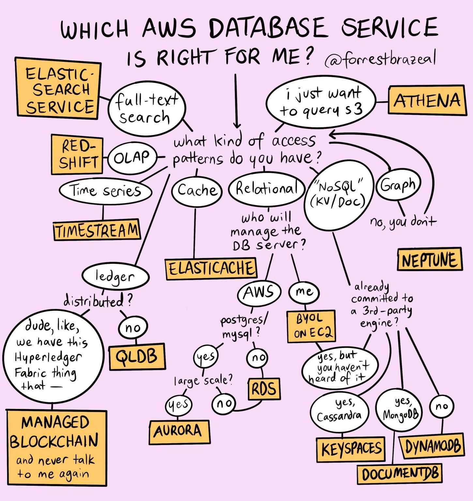

# AWS

### Storage

- S3 - Simple Storage Service - Object storage / blob storage
  - Security access using: IAM policies, bucket policies, ACLs, Query String Authentication
  - SSE-S3 - each object encrypted with unique key - ‘x-amz-server-side-encryption’:’AES256’
  - SSE-KMS - audit trail when KMS used - ‘x-amz-server-side-encryption’:’aws:kms’
  - SSE-C - Customer-Provided Keys
- RDS
  - Relational Databases - Postgresql, MySQL, MariaDB
  - NewSQL - AuroraDB (with serverless option)
- DynamoDB - NoSQL key-value
  - Transactions group multiple actions as all-or-nothing TransactWriteItems or TransactGetItems operations
  - Read capacity unit - 1 strongly consistent read per second or 2 eventually consistent read per second for an item up to 4 KB in size
  - DAX - DynamoDB Accelerator - in-memory cache
- DMS - Data Migration Services
- ElastiCache - distributed in-memory data store built on Redis or Memcached
  - Memcached is designed for simplicity
  - Redis provides snapshots facility, replication, and supports transactions
  - Lazy Loading / Write Through
- EBS - Elastic Block Store - volumes with persistent file storage - AZ locked
  - maximum ratio of provisioned IOPS to requested volume size (in GiB) is 50:1
- ElasticSearch aka OpenSearch - “google search” like feature, indexed for e.g. monitoring logs

### Hosting

- EB - Elastic Beanstalk – Websites provisioned and deployed with CloudFormation
  - Deployment strategies - All-at-Once, Rolling, Rolling with Additional Batch, Immutable
- EC2  - Elastic Compute Cloud - Virtual Machine Instances
  - AMI - Amazon Machine Images
    - EBS (Elastic Block Store) snapshots - instance-store-backed AMIs
    - Template for the root volume (e.g. OS, Application Servers, Applications)
- NLB - Network Load Balancer (Network Layer 4 - Transport layer)
  - Fault tolerance
  - SSL Termination
  - Sticky Sessions
  - Termination of Idle Sessions
- ALB - Application Load Balancer (Network Layer 7 - Application layer)
  - Routing based on user-defined rules
  - Content-based routing (route based on URL’s host or path or request header)
  - Target Groups - destination of routing based on a type of target:
    - Instances
    - IP addresses
    - Lambda functions
- CloudFront - CDN (Content Delivery Network) - Caches and serves static and dynamic content
  - Uses AWS Shield Standard to defend against DDoS attacks
  - Signed URLs/Cookies use signer’s private key. CloudFront uses the public key to verify
- API Gateway - REST/HTTP/WebSockets
  - Integration types - Lambda, HTTP, Mock, AWS Service, VPC Link
  - Lambda authorizers - control access to APIs with custom authorization scheme 
    - token-based (TOKEN authorizer) - bearer token authentication e.g. OAuth or SAML
    - request parameter-based (REQUEST authorizer) - caller id via  headers, query string
  - Cognito authorizers - control access to APIs from user pools with a token source
  - “Stages” - deployment environments
- AppSync - GraphQL Web API - connect to data sources like DynamoDB, Lambda
- ECS - Elastic Container Services - Docker management
  - ECR - Elastic Container Registry - Container repository
- EKS - Elastic Kubernetes Services - Create Kubernetes clusters in AWS
- Lambda - Serverless functions
  - SAM - Serverless Application Model - yaml config to deploy. Built on CloudFormation
  - “Aliases” - pointer to specific versions
  - MicroVM framework is the underlying technology
- Step Functions - low-code visual workflow service used to orchestrate AWS services
  - Distributed transactions using human interaction pattern, chaining pattern, saga pattern

### Security / Network

- Secrets Manager - uses KMS for decryption - allows rotation of encryption keys
  - designed for usernames and passwords
  - no plaintext storage, only encrypted data
- SSM - System Manager Parameter Store - uses KMS for decryption
  - designed for application configuration variables - URLs, DB hostnames, product keys
- KMS - Key Management Service - Region specific
  - Symmetric - single encryption key that is used for both encrypt and decrypt operations
  - Asymmetric - public/private key pair used for encrypt/decrypt or sign/verify operations
  - CMK - Customer Master Key - customer managed CMK or AWS managed CMK
- Amazon Cognito - user directory service to handle user registration, authentication, recovery
  - authentication (user pools) and authorization (identity pools) workflows
  - retrieve user pool tokens and obtain temporary credentials from your identity pool
  - AWS Amplify Framework - SDK - services and libraries that integrate with AWS Services
- VPC - Virtual Private Cloud
  - An isolated portion of the AWS cloud populated by AWS objects e.g. EC2 instances
  - Created with a CIDR (e.g. 10.0.0.0/16)
  - Subnets - a range of IPs in a VPC only in one AZ. Subnet CIDR within VPC’s CIDR
  - Gateway endpoints use AWS PrivateLink to connect external resources to private VPCs
- Security Groups
  - Virtual firewall for instances - control inbound traffic rules and outbound traffic rules
- Network ACLs
  - Virtual firewall for subnets - return traffic must be explicitly allowed by rules
- WAF - Web Application Firewall
  - monitor HTTP and HTTPS requests forwarded to CloudFront, API Gateway ALB, AppSync
- IAM - Identity and Access Management
  - control authentication (sign in) and authorization (permissions)
  - create Users, Groups, Policies (list of permissions)
  - supports federated users outside of AWS including AD integration by assuming IAM roles
  - Policy - defines permissions in JSON format
    - Services > Actions > Resources
    - Actions have 5 access levels - List, Read, Write, Permissions management, Tagging
    - Permission Policy - define the actions and resources a role can use
    - Trust Policy - list of principals - resource-based policy that is attached to a role
  - Roles don’t have credentials (password or Access Keys). Policies defined similar to Users
    - Users are attached to roles with temporary Access Keys created dynamically
    - STS - Security Token Service (via API) `aws sts assume-role –role-arn <arn:aws:iam:...>`
    - “Switch Roles” in account drop down (via Console)
  - IdP - Identity Provider - manage user identities outside AWS & grant permissions
- Permission Boundary - set limits to give maximum permissions for IAM entities
- Service Control Policy (SCP) - set limits to any accounts associated with the Organization Unit

### Messaging

- SQS - Simple Queue Service
  - Messages are polled by applications, uniquely read and “locked” (visible) until processed
  - Deleted by application
  - no limit to stored messages; 120,000 maximum “in flight” messages
- SNS - Simple Notification Service - pushed based A2A (App to App) or A2P (App to person)
  - pub/sub to SQS, Lambda, HTTPS endpoints, parallel processing, Kinesis Data Firehose
- SES - Simple Email Service
- Amazon MSK - Managed Streaming for Apache Kafka
- Kinesis Streams - event-streaming as opposed to push notification
  - producers & consumers, data records are sharded by a partition key
  - time-based sequence of events
- DynamoDB Streams - same as Kinesis but auto-scales the number of shards, no cost for reads
- EventBridge - service bus for webhooks (GitHub, Stripe, Twilio)
  - Event Ruler - component managing routing rules - APIs declaring pattern-matching rules

### Big Data

- EMR - Elastic Map Reduce (Hadoop, Spark)
- Kinesis Data Firehose - Batches event streams from Kinesis Streams into Redshift/S3/Mongo
- QuickSight - Business Intelligence
- Redshift - traditional Data Warehouse
  - AWS Data Exchange - subscribers to data from external sources ingested in Redshift
- Snowflake
  - Shared disk architecture - nodes with private memory share the same disk storage
  - Shared nothing architecture - nodes have their own separated disk storage (sharded)
  - Layers
    - Data storage (physical disks)
    - Query processing (warehouse clusters)
    - Cloud services (optimiser, infra mgmt, security, meta)
- Amazon Glue - used for transformations in an ETL processes

### Development

- AWS CodeArtifact - artifact repository for Maven, Gradle, npm, yarn, twine, pip, and NuGet 
- AWS CodeCommit - managed source control service that hosts private Git repositories
- AWS CodeBuild - fully managed CI service like Teamcity and Jenkins
- AWS CodeDeploy - automates application deployments to EC2, on-premises, Lambda, ECS
  - Blue/Green
    - EC2 - instances in a deployment group are replaced by a different set of instances
    - Lambda - traffic shifted from current serverless env to updated function versions
    - ECS - traffic shifted from original task set to replacement task set in the same service
  - In-place deployment - only for EC2 and on-premises
    - Load-balancer can deregister instances to update applications to new version
  - Hooks:
    - ApplicationStop, DownloadBundle,
    - BeforeInstall, Install, AfterInstall,
    - ApplicationStart, ValidateService,
    - BeforeBlockTraffic, BlockTraffic, AfterBlockTraffic,
    - BeforeAllowTraffic, AllowTraffic, AfterAllowTraffic
- AWS CodePipeline - CD - workflows to connect CodeCommit -> CodeBuild -> CodeDeploy
  - Action options - Source, Build, Test, Deploy, Approval, Invoke
  - Source can only be CodeCommit, S3, or GitHub
- Amazon CodeGuru - developer tool to make recommendations to code quality & efficiency
  - Reviewer - machine learning to identify critical issues, security vulnerabilities, and hard-to-find bugs to make recommendations to improve code quality
  - Profiler - find expensive lines of code from runtime behavior, identify inefficiencies, improve performance, and decrease compute costs
- AWS CodeStar - “Platform as a Service” - Develop, Build, and Deploy Applications ???
- AWS Fault Injection Simulator - fully managed service for running fault injection experiments
  - chaos engineering

### Observability

- CloudWatch - logs
  - agent - installed on EC2 to collect system-level metrics using StatsD & collectd protocols
  - alarms - “metric” (math expression) or “composite” alarms (alarm states of other alarms)
- AWS X-Ray - Distributed tracing system - adding traces in apps in EC2, ECS, Lambda, SQS, SNS
  - requires local daemon to receive traces via UDP, then batches traces to X-Ray Servers 
- CloudFormation
  - Configure environment using JSON or YAML
  - http://ide.visualops.io
  - EB Extensions allows customisation
  - “Stacks” for layering different resource creations
- CloudTrail - audit trails - monitors and records account activity

### Structure

- Organisation root
  - Organisation Unit (OU)
    - Organisation Unit (OU)
    - Accounts

### Misc 

- Amazon Resource Name (arn:aws:service:region:account-no:resource)
- Shared Responsibility Model
  - AWS - Security “of” the cloud - compute, storage, db, networking, regions, AZ, edge
  - Customer - Security “in” the cloud - platform, apps, IAM, OS, networking, firewall config
  - CAF - Cloud Adoption Framework - Align strategy, develop skills, execute initiatives, realise outcomes
  - Consider industry frameworks like the NIST Cybersecurity Framework (CSF) and ISO.
  - Cloud Audit Academy training programs
  - AWS Marketplace & AWS Security Competency Partners
  - Well-Architected Review for best practices of 5 pillars:
    - operational excellence
    - security
    - reliability
    - performance efficiency
    - cost optimization

### Datastores

